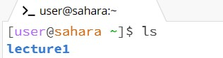
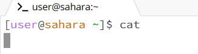
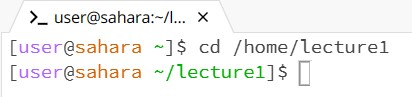
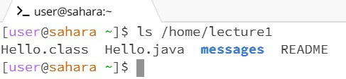
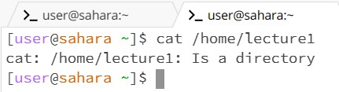
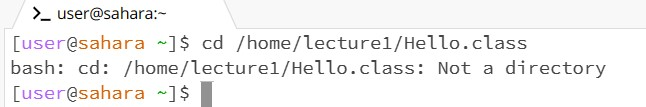
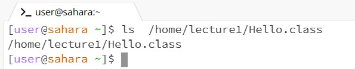
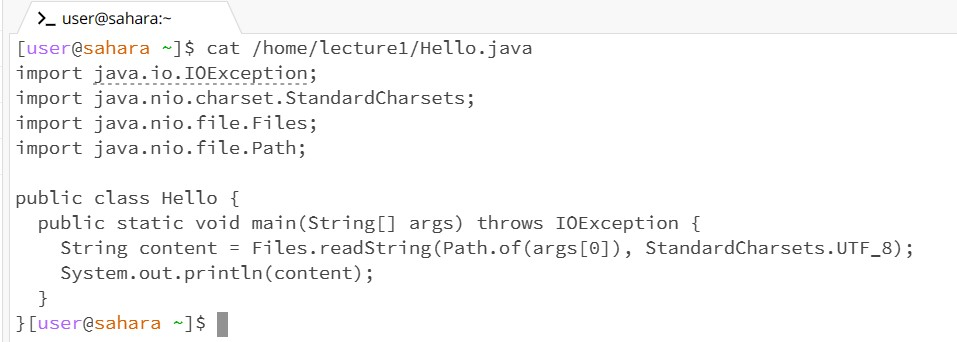

Remote Access and FileSystem

Running commands with no arguments:

Working directory: /home

Explanation: cd is meant to switch the working directory to the specified path, but with no specified path to switch to the command does nothing.

Working directory: /home

Explanation: ls lists the files/folders contained within the path. Given the current working directory is /home, the only folder contained directly within it is lecture1, thus "lecture1" is printed in the console.

Working directory: /home

Explanation: cat is supposed to print the contents of a given file and no file is specified in the path, therefore the command does nothing.

Running commands with path to directory:

Working directory before command: /home

Working directory after command: /home/lecture1

Explanation: cd moves the working directory to the specified path, so adding /home/lecture1 to the command moved the directory to lecture1.

Working directory before command: /home

Working directory after command: /home

Explanation: ls lists the files/folders contained in a specified path and thus adding /home/lecture1 to the command will make the console display the files/folders contained in lecture1 (as shown in the screenshot).

Working directory before command: /home

Working directory after command: /home

Explanation: cat is meant to print the contents of a given file, so only providing a path to a directory causes an error as shown by the output "is a directory".

Running commands with path to file:

Working directory during command: /home

Explanation: 

Working directory during command: /home

Explanation: 

Working directory during command: /home

Explanation: 
