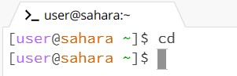

Remote Access and FileSystem

Running commands with no arguments:

Working directory: /home

Working directory: /home

Working directory: /home

Running commands with path to directory:

Working directory before command: /home

Working directory after command: /home/lecture1

Working directory before command: /home

Working directory after command: /home

Working directory before command: /home

Working directory after command: /home

Running commands with path to file:

Working directory before command: /home
Working directory after command: /home/lecture1

Working directory before command: /home
Working directory after command: /home/lecture1

Working directory before command: /home
Working directory after command: /home/lecture1
